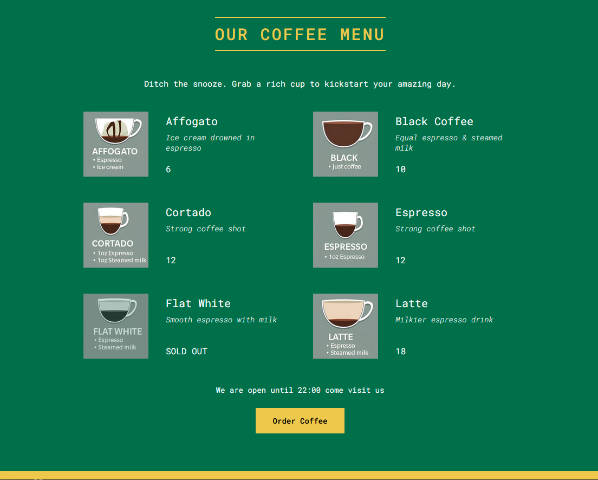

# React - Coffee menu

# 🔗 [Live Preview]()

---

## About 👋

A simple React exercise app that displays a coffee shop menu using map mathod, props and components which are not divided and separated on purpose.

---

## Features 👨‍💻

- Lists various coffee drinks with descriptions and (simulated) prices.
- Displays a message if the shop is currently closed (based on pre-defined opening hours).
- Includes a button labeled "Order Coffee" (currently non-functional).

---

## Code Structure:

- App.js: The main application component, responsible for rendering the header, menu, and footer.
- Header.js: Displays the coffee shop name as a heading.
- Menu.js: Renders the list of coffee drinks using coffeeData.js.
- Coffee.js: Displays an individual coffee item with its name, description, and price.
- Footer.js: Shows a message based on the current time and pre-defined opening hours. It also includes a non-functional "Order Coffee" button.
- coffeeData.js: Contains an array of objects defining each coffee drink with its name, description, price, and photo path (simulated).

---

## Languages

- React: functions, conditionals, useState, components, props
- Styling: basic 
